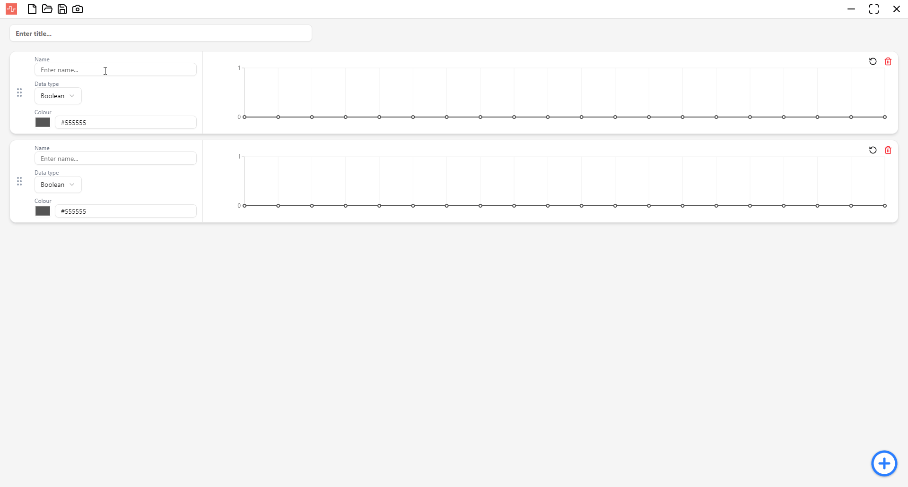
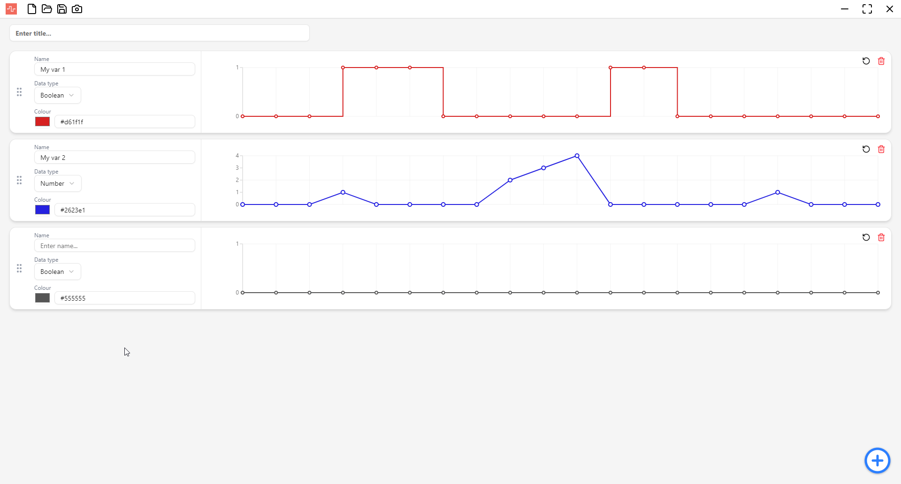
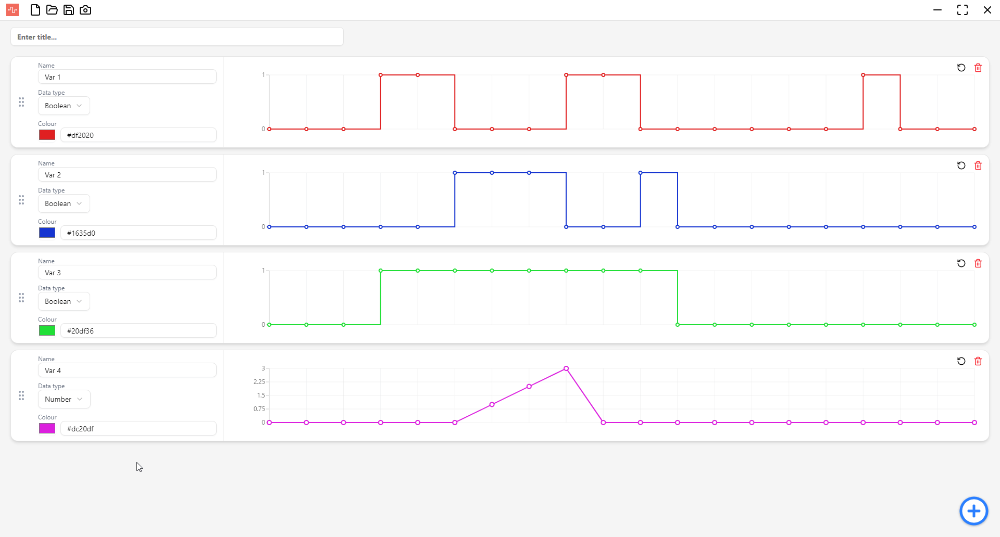
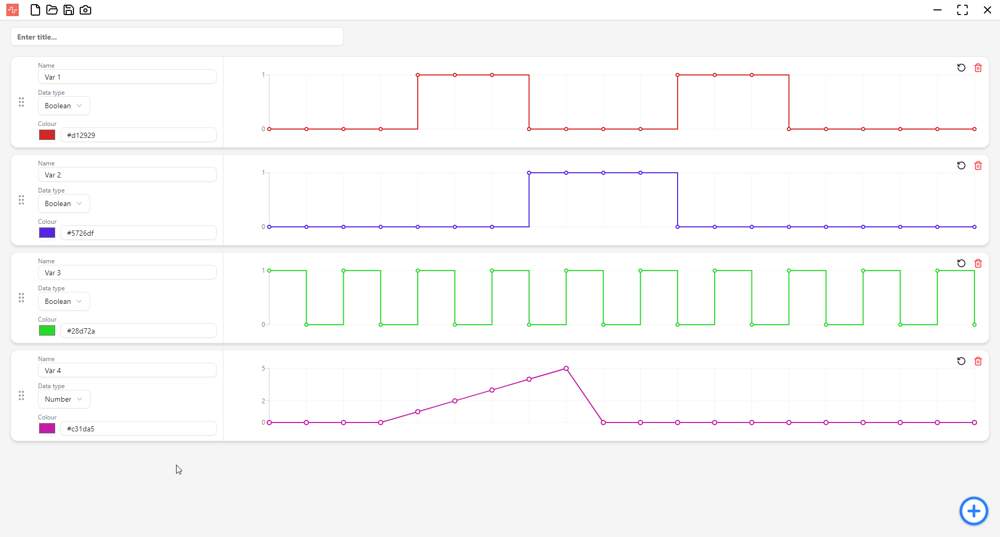

# 

<p align="center">
  
  
  
  
</p>

---

## About

**TimeDraw** is an open source cross-platform desktop application for creating and sharing time-based diagrams. It offers a fast, intuitive, and beautiful interface for creating, editing, and exporting time diagrams.

The app is **cross-platform** and runs on Linux, Windows and macOS.

---

## Built with

<p align="center">
  
  
  
  
</p>

---

## Features

### Interactive time diagrams

Create and edit time diagrams of `boolean` and `number` types with ease by clicking on the dots to change the diagram's value in that point. Change the information of the diagram and set colors by selecting them from a color picker, or directly write the code in any format you want.

<p align="center">
  
</p>

### Drag and drop

Easily swap diagrams position by drag and dropping them around.

<p align="center">
  
</p>

### Open / Save

Save your diagram setup for later use and share it with anyone but simply sharing a JSON file.

<p align="center">
  
</p>

### Take a snapshot

Export your diagram setup to a beautiful JPEG file and share it with anyone who needs a clean and clear view of the diagram, or add it to your documentation.

> A picture tells a thousand words.

<p align="center">
  
</p>

---

## Getting Started

1. **Download** the latest release from the [Releases](https://github.com/dRamosCode/timeDraw/releases) page.
2. **Install** by running the setup executable for your platform.
3. **Launch** TimeDraw and start creating your diagrams!

---

## Contributing

Contributions to the repo are welcome! Follow these steps to contribute:

1. **Fork** the repository

2. **Clone** your fork to your local machine

```bash
git clone https://github.com/dRamosCode/kawasaki-as-vscode-extension.git
```

3. **Install** dependencies

```bash
npm install
```

4. Create a new **branch**

```bash
git checkout -b feature/your-feature-name
```

5. Make your **changes**

6. **Run** the app and **test** everything works fine

7. **Commit** your changes

```bash
git add .
git commit -m "Add a brief description of your change"
```

8. **Push** your branch to your fork

```bash
git push origin feature/your-feature-name
```

9. Create a **Pull Request**

---

## License

This project is licensed under the MIT License. See [LICENSE.md](LICENSE.md) for details.
